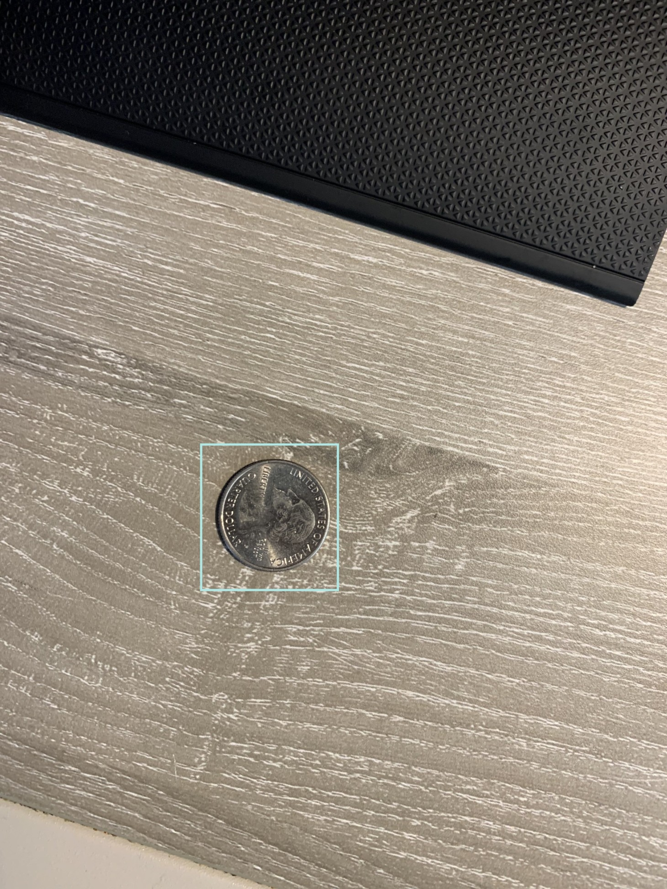
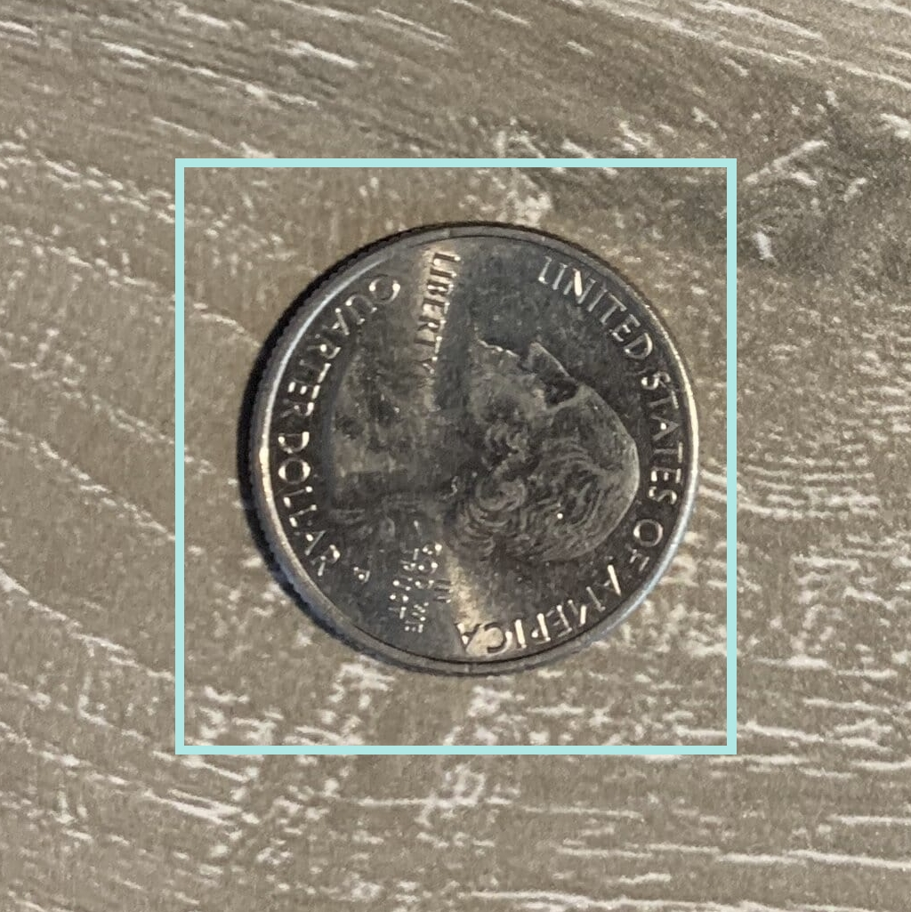
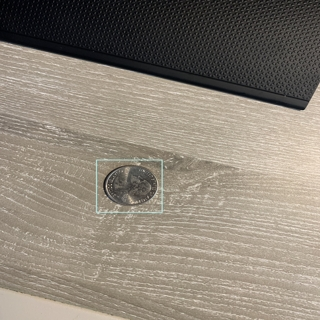

# Crop to Bounding Boxes
Most, if not all, backbone models for object detection resize your image data to fixed dimensions before they are passed forward through the network. The typical dimensions are 1024x1024, 640x640, or 320x230. If you have images that are significantly large in size (e.g., the default resolution of an iPhone photo) and objects that have significantly small bounding boxes within the image, then most of the important details of the object could be lost when the image is resized.

## Smart Cropping
One solution to this problem is to remove unnecessary background from the top, bottom, left, and right of the image, so that most of the object's information is kept during image resizing.

The 'smart_crop.py' file contains a `smart_crop` function which takes a PIL image and a Pascal VOC 1.1 annotation XML object, and returns a cropped PIL image, and an updated Pascal VOC 1.1 annotation object with the new correct coordinates for all bounding boxes.

## Comparison
Here is an example of how an image could look after being cropped to 1024x1024:

|Original|Cropped to 1024x1024|
|--|--|
|   Size: (3024, 4032)|   Size: (1024, 1025)|

And here is what the model would see after resizing the image dowm to 320x320:
|Original Resized to 320x320|Cropped to 1024x1024 and Resized to 320x320|
|--|--|
|   Size: (320, 320)|   Size: (320, 320)|