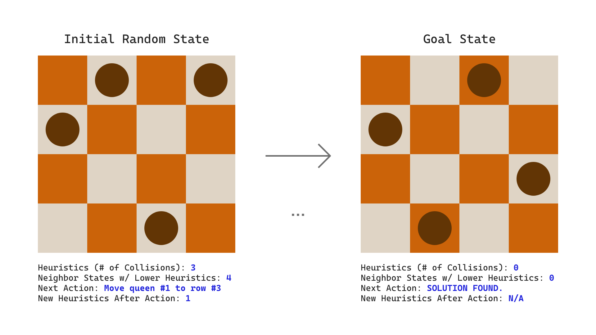

# N-Queens Problem [👸🏽, 👸🏼, 👸🏾, ..., 👸🏻]
The N-Queens problem requires that `N` queens be placed on a `NxN` board so that no queen occupies the same row, column or diagonal as another queen. The N-Queens problem can be solved using the Hill-Climbing algorithm with random restarts.



## Solution: The Hill-Climbing Algorithm
We must first generate a random starting state which places a queen in a random row of each column. From there, we first check to see if the board is a goal state (no queens are in conflict). If not, we evaluate all of the possible neighbor states by moving each column’s queen through the rows of its column and generating a heuristic value for each of those states. When all of the neighbor states have been generated, we check to see if any states were generated that have a lower heuristic value than the current state. If a better state was not found, then we have reached the local minima and must perform a random restart. If a better (lower heuristic) state was found, then that state becomes the current state and the above process is repeated on that state.

## Keywords
- **Heuristics**: A *heuristic* is a measurement of how far away the current state is from the the goal state. In the case of the N-Queens problem, the goal state is to have 0 collisions, so the goal heuristic is 0. At any given state, the number of collisions represent the heuristic for that state.
- **Neighboring States**: A *neighboring state* is the state in which the board would be if a single move is performed. With the Hill-Climbing algorithm, we look at all possible neighboring states, and choose the state that will produce the lowest heuristic. At any give state, an `NxN` board will produce `N^2 - N` neighboring states.
- **Local Minima**: In the Hill-Climbing algorithm, a *local minima* is reached if the current state has a non-zero heuristic, and none of its neighboring states produce a lower heuristic. In other words, the algorithm cannot find a better solution than the current state.

## Example Execution
The following execution is the output of the program for a 5x5 board:

```
Current Heuristics: 6
Neighbor States With Lower Heuristics: 12
Lowest Heuristic Possible: 3
---- Board State ----
0 0 0 0 0
0 0 0 0 0
0 1 0 0 0
1 0 1 1 0
0 0 0 0 1
Next Action: Move queen #2 to row #0.

Current Heuristics: 3
Neighbor States With Lower Heuristics: 5
Lowest Heuristic Possible: 2
---- Board State ----
0 0 1 0 0
0 0 0 0 0
0 1 0 0 0
1 0 0 1 0
0 0 0 0 1
Next Action: Move queen #0 to row #1.

Current Heuristics: 2
Neighbor States With Lower Heuristics: 0
Lowest Heuristic Possible: 2
---- Board State ----
0 0 1 0 0
1 0 0 0 0
0 1 0 0 0
0 0 0 1 0
0 0 0 0 1
Next Action: RESTART.

Current Heuristics: 3
Neighbor States With Lower Heuristics: 4
Lowest Heuristic Possible: 2
---- Board State ----
0 0 1 1 0
0 0 0 0 0
0 0 0 0 0
0 1 0 0 1
1 0 0 0 0
Next Action: Move queen #0 to row #1.

Current Heuristics: 2
Neighbor States With Lower Heuristics: 2
Lowest Heuristic Possible: 1
---- Board State ----
0 0 1 1 0
1 0 0 0 0
0 0 0 0 0
0 1 0 0 1
0 0 0 0 0
Next Action: Move queen #1 to row #4.

Current Heuristics: 1
Neighbor States With Lower Heuristics: 1
Lowest Heuristic Possible: 0
---- Board State ----
0 0 1 1 0
1 0 0 0 0
0 0 0 0 0
0 0 0 0 1
0 1 0 0 0
Next Action: Move queen #2 to row #2.

Current Heuristics: 0
Neighbor States With Lower Heuristics: 0
Lowest Heuristic Possible: N/A
---- Board State ----
0 0 0 1 0
1 0 0 0 0
0 0 1 0 0
0 0 0 0 1
0 1 0 0 0

SOLUTION FOUND!
Number of Resets: 1
Number of State Changes: 5
```